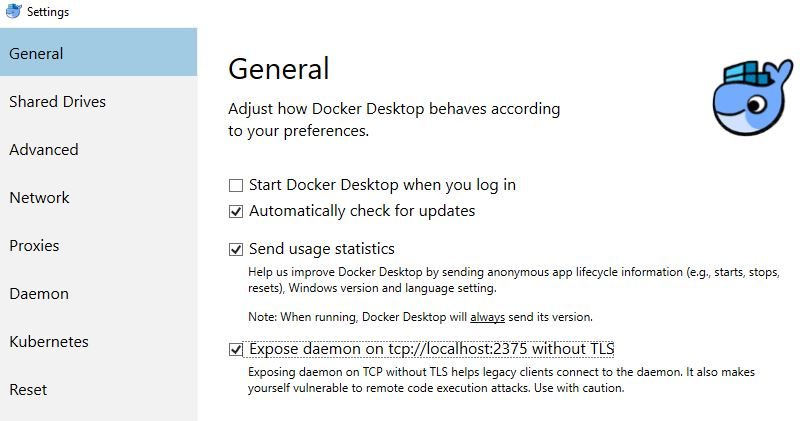

# sample-spring-kotlin

Error org.apache.http.conn.HttpHostConnectException: Connect to localhost:2375 [localhost/127.0.0.1, localhost/0:0:0:0:0:0:0:1] failed: Connection refused: connect

Solve the error by exposing daemon without TLS

